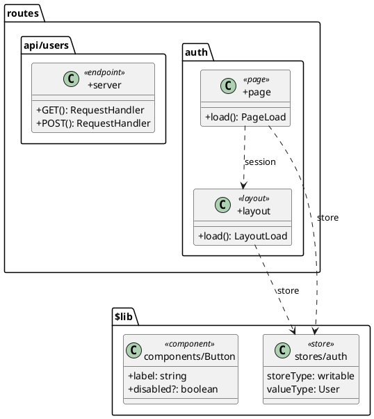

# SvelteUML

[](https://github.com/user/svelteuml/actions/workflows/ci.yml)
[](https://github.com/user/svelteuml)
[](https://opensource.org/licenses/MIT)
[](https://nodejs.org/)

Static analysis tool that generates PlantUML architecture diagrams from SvelteKit codebases. Uses `svelte2tsx` + `ts-morph` to parse components, stores, routes, props, events, and server endpoints — producing class diagrams, package diagrams, or SVG/PNG output. No runtime required; analyzes source directly.

## Quick Start

```bash
# Install globally
pnpm add -g svelteuml

# Or run without installing
npx svelteuml generate ./my-sveltekit-app

# Generate a class diagram (default)
svelteuml generate ./my-sveltekit-app

# Generate to a specific file
svelteuml generate ./my-sveltekit-app -o docs/architecture.puml

# Generate SVG (requires Java + PlantUML)
svelteuml generate ./my-sveltekit-app -f svg -o diagram.svg
```

## CLI Reference

### Subcommands

| Subcommand | Description |
|------------|-------------|
| `generate` | Generate a PlantUML diagram from a SvelteKit project |
| `watch` | Watch files and regenerate diagram on change |

### Flags

| Flag | Description | Default |
|------|-------------|---------|
| `-o, --output <path>` | Output file path | `diagram.puml` |
| `-f, --format <type>` | Output format: `text`, `svg`, `png` | `text` |
| `-d, --diagram <kind>` | Diagram kind: `class`, `package` | `class` |
| `--class-diagram` | Generate a class diagram (default) | `false` |
| `--package-diagram` | Generate a package diagram | `false` |
| `-e, --exclude [glob...]` | Glob patterns to exclude from discovery | `[]` |
| `--exclude-patterns [glob...]` | Glob patterns to exclude from output diagram | `[]` |
| `--exclude-externals` | Exclude external dependencies (node_modules) | `false` |
| `--max-depth <n>` | Max dependency traversal depth (0 = unlimited) | `0` |
| `--hide-type-deps` | Hide TypeScript type dependencies | `false` |
| `--hide-state-deps` | Hide Svelte store/state dependencies | `false` |
| `--focus <name>` | Focus on a specific node and its neighbourhood | — |
| `--layout-direction <dir>` | Layout direction for PlantUML | `top-to-bottom` |
| `--detect-circular` | Detect and report circular dependencies | `false` |
| `--fail-on-circular` | Exit with error code on circular deps | `false` |
| `--disable-colors` | Disable stereotype color theming | `false` |
| `-q, --quiet` | Suppress all output | `false` |
| `--verbose` | Show verbose output | `false` |

### Layout Directions

- `top-to-bottom` (default)
- `left-to-right`
- `bottom-to-top`
- `right-to-left`

### Examples

```bash
# Generate with max depth 2
svelteuml generate ./my-app --max-depth 2

# Focus on a single component
svelteuml generate ./my-app --focus Button

# Package diagram
svelteuml generate ./my-app --package-diagram -o packages.puml

# Watch mode
svelteuml watch ./my-app

# Detect circular dependencies
svelteuml generate ./my-app --detect-circular

# Fail build on circular deps
svelteuml generate ./my-app --detect-circular --fail-on-circular

# Exclude test files and generated code
svelteuml generate ./my-app -e "**/*.test.ts" -e "**/__generated__/**"

# Exclude patterns from the output diagram
svelteuml generate ./my-app --exclude-patterns "**/node_modules/**"

# Left-to-right layout with no colors
svelteuml generate ./my-app --layout-direction left-to-right --disable-colors

# Pipe PlantUML text to external renderer
svelteuml generate ./my-app -f text | plantuml -pipe > diagram.svg
```

## Features

### Class Diagrams

Default diagram type. Shows classes, interfaces, stores, routes, components, and functions as PlantUML classes with stereotypes and members.

```bash
svelteuml generate ./my-app
```

Classes rendered with visibility (`+`, `-`, `#`), properties, methods, and type parameters. Stores show `storeType` and `valueType`. Routes show path segments, params, and groups.

### Package Diagrams

Group symbols by their filesystem path into PlantUML `package` blocks. Shows high-level module structure without individual members.

```bash
svelteuml generate ./my-app --package-diagram
```

### Component Edges

Detects Svelte component imports and draws `-->` arrows from parent to child component.

### Store Subscription Edges

Detects `$storeName` auto-subscription in `.svelte` files (the Svelte `$` prefix syntax). Draws `..>` edges from component to store file labeled with the store name.

```bash
svelteuml generate ./my-app --hide-state-deps  # hide store edges
```

### Server Load Edges

Tracks data flow from `+page.server.ts` / `+layout.server.ts` to the corresponding `.svelte` page. Detects `$page.data` and `$page.url` usage to draw `..>` edges.

### Slot Edges

Tracks `<slot>` and `<slot name="...">` usage. Draws `..>` edges labeled `slot:<name>` from child component back to parent.

### Prop Flow Edges

Tracks prop passing from parent to child. Draws `-->` edges with prop type signatures.

```plantuml
ParentForm --> Button : onClick: (e: Event) => void
```

### Event Edges

Tracks `createEventDispatcher` usage. Draws `..>` edges from child to parent labeled with event names.

### Circular Dependency Detection

Detect cycles in your dependency graph. Reports each cycle's file chain.

```bash
svelteuml generate ./my-app --detect-circular
# Circular dependency: src/lib/stores/auth.ts -> src/lib/utils/api.ts -> src/lib/stores/auth.ts
```

With `--fail-on-circular`, exits with code 1 (useful for CI gates).

### Alias Grouping

Respects SvelteKit path aliases (`$lib`, `$components`, custom). Components under an alias are grouped into a PlantUML `package` with the alias name. Configurable via `aliasOverrides`.

### Config File Support

Supports three config file formats (searched in order):

| File | Format |
|------|--------|
| `svelteuml.config.ts` | TypeScript module |
| `.svelteumlrc.json` | JSON |
| `.svelteumlrc` | JSON (no extension) |

CLI flags override config file values.

### Comments DSL (`@uml.*` tags)

Annotate Svelte components with HTML comments to control diagram behavior:

```svelte
<!-- @uml.hide -->
<script>...</script>
```

| Tag | Description |
|-----|-------------|
| `@uml.hide` | Exclude component from diagram output |
| `@uml.group("name")` | Group component into named package |
| `@uml.color("color")` | Custom stereotype color (CSS name or hex) |
| `@uml.focus` | Mark component as a focus node |

## Output Formats

| Format | Extension | Requires | Description |
|--------|-----------|----------|-------------|
| `text` | `.puml` | Nothing | Raw PlantUML DSL text |
| `svg` | `.svg` | Java + PlantUML CLI | Vector graphic |
| `png` | `.png` | Java + PlantUML CLI | Raster graphic |

```bash
# SVG output
svelteuml generate ./my-app -f svg -o diagram.svg

# PNG output
svelteuml generate ./my-app -f png -o diagram.png

# Text to stdout (pipe to other tools)
svelteuml generate ./my-app -f text > diagram.puml
```

## Configuration Reference

Create `.svelteumlrc.json` in your project root:

```json
{
  "targetDir": "./src",
  "outputPath": "docs/architecture.puml",
  "exclude": ["**/*.test.ts", "**/*.spec.ts"],
  "include": [],
  "maxDepth": 3,
  "excludeExternals": true,
  "aliasOverrides": {
    "$components": "./src/components",
    "$utils": "./src/lib/utils"
  }
}
```

### Schema

| Field | Type | Default | Description |
|-------|------|---------|-------------|
| `targetDir` | `string` | `process.cwd()` | Path to SvelteKit project root |
| `outputPath` | `string` | `"diagram.puml"` | Output file path |
| `exclude` | `string[]` | `[]` | Glob patterns to exclude from discovery |
| `include` | `string[]` | `[]` | Additional glob patterns to include |
| `maxDepth` | `number` | `0` | Max dependency traversal depth (0 = unlimited) |
| `excludeExternals` | `boolean` | `false` | Truncate at node_modules boundaries |
| `aliasOverrides` | `Record<string, string>` | `{}` | Custom path alias overrides |

CLI flags always override config file values.

## Example Output



## Architecture

SvelteUML uses a 5-phase pipeline:

```text
┌─────────────┐    ┌───────────┐    ┌─────────────┐    ┌────────────┐    ┌───────────┐
│  Discovery  │───>│  Parsing  │───>│  Extraction │───>│ Resolution │───>│ Emission  │
│             │    │           │    │             │    │            │    │           │
│ Find files  │    │ svelte2tsx│    │  Symbols    │    │  Edges     │    │ PlantUML  │
│ Load config │    │ ts-morph  │    │  Props      │    │  Imports   │    │  DSL      │
│ Aliases     │    │ VFS       │    │  Routes     │    │  Reactive  │    │  SVG/PNG  │
└─────────────┘    └───────────┘    └─────────────┘    └────────────┘    └───────────┘
```

1. **Discovery** — Recursively find `.svelte`, `.ts`, `.js` files. Load `svelte.config.js` and `.svelte-kit/tsconfig.json` for path aliases.
2. **Parsing** — Transform `.svelte` SFCs to TSX via `svelte2tsx`. Build a `ts-morph` Project with virtual file system.
3. **Extraction** — Extract components, props, stores, routes, server endpoints, lib functions, classes, events.
4. **Resolution** — Scan imports, build dependency edges (composition, inheritance, type, store, server-load, prop-flow, slot, event). Track reactive `$state`/`$derived` cross-file references.
5. **Emission** — Generate PlantUML DSL with nested packages, stereotypes, relationship arrows. Optionally render to SVG/PNG.

## Development

| Command | Description |
|---------|-------------|
| `pnpm build` | Compile TypeScript to `dist/` |
| `pnpm dev` | Watch mode compilation |
| `pnpm test` | Run unit tests |
| `pnpm test:watch` | Run tests in watch mode |
| `pnpm test:coverage` | Run tests with coverage |
| `pnpm test:integration` | Run integration tests |
| `pnpm test:mutation` | Run Stryker mutation tests |
| `pnpm run typecheck` | Type-check without emitting |
| `pnpm run lint` | Lint with Biome |
| `pnpm run format` | Format with Biome |

### Property-Based Testing

Uses [fast-check](https://github.com/dubzzz/fast-check) alongside unit tests.

| Convention | Standard |
|---|---|
| Generator naming | Prefix with `arb` (e.g. `arbEdge`, `arbEdgeType`) |
| File naming | `*.property.test.ts` |
| Local runs | 100 cases (`VITEST_PBT_NUM_RUNS=100`) |
| CI runs | 200 cases (`VITEST_PBT_NUM_RUNS=200`) |

### Contributing

1. Clone: `git clone https://github.com/Jonathangadeaharder/svelteuml.git`
2. Install: `pnpm install`
3. Branch: `git checkout -b feature/my-feature`
4. Check: `pnpm test && pnpm run typecheck && pnpm run lint`
5. PR: Submit a pull request

## License

MIT
