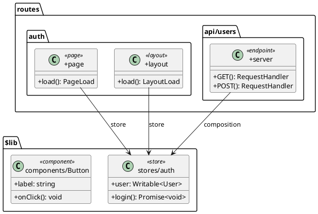

# SvelteUML

[](https://github.com/user/svelteuml/actions/workflows/ci.yml)
[](https://github.com/user/svelteuml)
[](https://opensource.org/licenses/MIT)
[](https://nodejs.org/)

Architecture and Dependency Visualization for SvelteKit: TypeScript-Native PlantUML Generator.

Generates PlantUML class and package diagrams from SvelteKit codebases using static analysis (svelte2tsx + ts-morph pipeline). No runtime required — analyzes your source code directly.

## Installation

```bash
# npm
npm install -g svelteuml

# pnpm
pnpm add -g svelteuml

# Or use without installing
npx svelteuml ./my-sveltekit-app
```

## Quick Start

```bash
# Generate a PlantUML diagram from a SvelteKit project
svelteuml ./my-sveltekit-app

# Specify output path
svelteuml ./my-sveltekit-app -o architecture.puml

# Generate SVG (requires Java + PlantUML)
svelteuml ./my-sveltekit-app -f svg -o diagram.svg
```

## Usage

```
svelteuml <target-directory> [options]
```

### Options

| Flag | Description | Default |
|------|-------------|---------|
| `-o, --output <path>` | Output file path | `diagram.puml` |
| `-f, --format <type>` | Output format: `text`, `svg`, `png` | `text` |
| `--exclude-externals` | Exclude external dependencies (node_modules) | `false` |
| `--max-depth <n>` | Max dependency traversal depth (0 = unlimited) | `0` |
| `-e, --exclude [glob...]` | Glob patterns to exclude | `[]` |
| `--hide-type-deps` | Hide TypeScript type dependencies | `false` |
| `--hide-state-deps` | Hide Svelte store/state dependencies | `false` |
| `-q, --quiet` | Suppress all output | `false` |
| `--verbose` | Show verbose output | `false` |
| `--watch` | Watch for file changes | `false` |

### Examples

```bash
# Generate diagram excluding node_modules dependencies
svelteuml ./my-app --exclude-externals

# Limit dependency depth to 2 levels
svelteuml ./my-app --max-depth 2

# Exclude test files and generated code
svelteuml ./my-app -e "**/*.test.ts" -e "**/__generated__/**"

# Hide type-only imports for cleaner diagrams
svelteuml ./my-app --hide-type-deps

# Watch mode — regenerate on file changes
svelteuml ./my-app --watch

# Output to stdout (pipe to other tools)
svelteuml ./my-app -f text | plantuml -pipe > diagram.svg
```

## Configuration

Create a `.svelteumlrc.json` in your project root to set default options:

```json
{
  "targetDir": "./src",
  "outputPath": "docs/architecture.puml",
  "exclude": ["**/*.test.ts", "**/*.spec.ts"],
  "include": [],
  "maxDepth": 3,
  "excludeExternals": true,
  "aliasOverrides": {
    "$custom": "./src/custom"
  }
}
```

### Config Schema

| Field | Type | Description |
|-------|------|-------------|
| `targetDir` | `string` | Path to SvelteKit project root |
| `outputPath` | `string` | Output file path (default: `diagram.puml`) |
| `exclude` | `string[]` | Glob patterns to exclude from discovery |
| `include` | `string[]` | Additional glob patterns to include |
| `maxDepth` | `number` | Max dependency traversal depth (0 = unlimited) |
| `excludeExternals` | `boolean` | Truncate at node_modules boundaries |
| `aliasOverrides` | `Record<string, string>` | Custom path alias overrides |

CLI flags override config file values.

## Architecture

SvelteUML uses a 5-phase pipeline:

```
┌─────────────┐    ┌───────────┐    ┌─────────────┐    ┌────────────┐    ┌───────────┐
│  Discovery  │───>│  Parsing  │───>│  Extraction │───>│ Resolution │───>│ Emission  │
│             │    │           │    │             │    │            │    │           │
│ Find files  │    │ svelte2tsx│    │  Symbols    │    │  Edges     │    │ PlantUML  │
│ Load config │    │ ts-morph  │    │  Props      │    │  Imports   │    │  DSL      │
│ Aliases     │    │ VFS       │    │  Routes     │    │  Reactive  │    │  SVG/PNG  │
└─────────────┘    └───────────┘    └─────────────┘    └────────────┘    └───────────┘
```

1. **Discovery** — Recursively find `.svelte`, `.ts`, `.js` files. Load `svelte.config.js` and `.svelte-kit/tsconfig.json` for path aliases.
2. **Parsing** — Transform `.svelte` SFCs to TSX via `svelte2tsx`. Build a `ts-morph` Project with virtual file system.
3. **Extraction** — Extract components, props, stores, routes, server endpoints, lib functions/classes.
4. **Resolution** — Scan imports, build dependency edges (composition, inheritance, type, store). Track reactive `$state`/`$derived` cross-file references.
5. **Emission** — Generate PlantUML DSL with nested packages, stereotypes, and relationship arrows.

## Supported Features

| Feature | Support |
|---------|---------|
| Svelte 4 (`export let`) | ✅ |
| Svelte 5 (`$props()` runes) | ✅ |
| `$state`, `$derived`, `$effect` | ✅ |
| `.svelte.ts` stores | ✅ |
| `+page.svelte` / `+page.ts` | ✅ |
| `+layout.svelte` / `+layout.ts` | ✅ |
| `+server.ts` endpoints | ✅ |
| `(group)` layouts | ✅ |
| `[param]` dynamic routes | ✅ |
| `[...slug]` catch-all routes | ✅ |
| Path aliases (`$lib`, custom) | ✅ |
| Type-only imports | ✅ (filterable) |
| Store dependencies | ✅ (filterable) |

## Example Output



## Development

| Command | Description |
|---------|-------------|
| `pnpm build` | Compile TypeScript to `dist/` |
| `pnpm dev` | Watch mode compilation |
| `pnpm test` | Run unit test suite |
| `pnpm test:watch` | Run tests in watch mode |
| `pnpm test:coverage` | Run tests with coverage |
| `pnpm test:integration` | Run integration tests |
| `pnpm test:mutation` | Run Stryker mutation tests |
| `pnpm run typecheck` | Type-check without emitting |
| `pnpm run lint` | Lint with Biome |
| `pnpm run format` | Format with Biome |

### Contributing

1. Clone the repository
2. Install dependencies: `pnpm install`
3. Create a feature branch: `git checkout -b feature/my-feature`
4. Make changes and add tests
5. Run checks: `pnpm test && pnpm run typecheck && pnpm run lint`
6. Submit a pull request

## License

MIT
